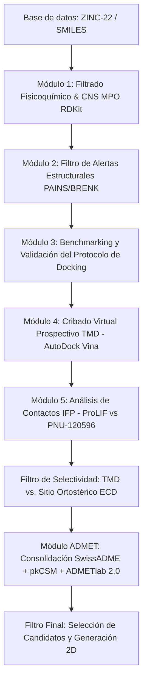

# Cribado Virtual de Moduladores Alostéricos del Receptor Nicotínico $\alpha7$ (nAChR $\alpha7$)

Este repositorio contiene el pipeline computacional y los scripts desarrollados para el Trabajo de Fin de Máster (TFM) titulado: **"Cribado Virtual y Diseño de Fármacos Basado en Estructura (SBDD) para Moduladores Alostéricos Positivos de Tipo II en el Canal Nicotínico $\alpha7$ nAChR"**.

El objetivo científico principal de este proyecto es la identificación de candidatos moleculares con alta permeabilidad al sistema nervioso central (SNC) que actúen como moduladores alostéricos positivos tipo II (PAM Tipo II), dirigidos específicamente al **sitio transmembrana (TMD) intrasubunitario** del receptor pentamérico nAChR $\alpha7$.

---

## Contexto Farmacológico y Bioinformático

El receptor nicotínico de acetilcolina $\alpha7$ (nAChR $\alpha7$) es un canal iónico pentamérico clave implicado en funciones cognitivas superiores y procesos inflamatorios. Su disfunción se asocia a patologías neurológicas y psiquiátricas como la enfermedad de Alzheimer y la esquizofrenia. 

A diferencia de los agonistas ortostéricos que saturan el sitio extracelular (ECD), los **PAMs de Tipo II** modulan el receptor desde el dominio transmembrana (TMD), prolongando la apertura del canal y previniendo la desensibilización. Este repositorio implementa un flujo SBDD (*Structure-Based Drug Design*) estricto para encontrar dichos compuestos en librerías masivas de moléculas (como ZINC-22):



---

## Estructura del Repositorio

El repositorio se organiza de la siguiente manera:

*   [`environment.yml`](file:///Users/aitor/tfm_alpha7/environment.yml): Archivo de configuración de Conda con las dependencias y versiones de software.
*   [`setup_environment.sh`](file:///Users/aitor/tfm_alpha7/setup_environment.sh): Script de Bash para la instalación automatizada y testeo del entorno científico.
*   [`LICENSE`](file:///Users/aitor/tfm_alpha7/LICENSE): Licencia del proyecto (MIT).
*   [`PIPELINE.md`](file:///Users/aitor/tfm_alpha7/PIPELINE.md): Guía de usuario paso a paso con los comandos CLI para ejecutar cada etapa.
*   [`scripts/`](file:///Users/aitor/tfm_alpha7/scripts/): Scripts del pipeline bioinformático:
    *   [`verify_installation.py`](file:///Users/aitor/tfm_alpha7/scripts/verify_installation.py): Verifica la salud del entorno de Conda y las herramientas de línea de comandos.
    *   [`mol_properties_rdkit.py`](file:///Users/aitor/tfm_alpha7/scripts/mol_properties_rdkit.py): Biblioteca de cálculo de descriptores, pKa básico y puntuación CNS MPO (*Central Nervous System Multiparameter Optimization*).
    *   [`library_builder.py`](file:///Users/aitor/tfm_alpha7/scripts/library_builder.py): Filtrado fisicoquímico, aplicación de alertas PAINS/BRENK y desduplicación estructural rápida.
    *   [`docking_pipeline.py`](file:///Users/aitor/tfm_alpha7/scripts/docking_pipeline.py): Valida el protocolo (redocking RMSD y enriquecimiento BEDROC/AUC-ROC), corre el cribado en TMD y genera las huellas de interacción (IFP) con ProLIF.
    *   [`recover_from_docking.py`](file:///Users/aitor/tfm_alpha7/scripts/recover_from_docking.py): Recuperador de datos para continuar el pipeline a partir de poses ya calculadas, evitando re-ejecutar corridas largas de Vina.
    *   [`docking_ecd_selectivity.py`](file:///Users/aitor/tfm_alpha7/scripts/docking_ecd_selectivity.py): Evalúa la especificidad de los hits dockeando contra el sitio de epibatidina en el ECD.
    *   [`admet_import_results.py`](file:///Users/aitor/tfm_alpha7/scripts/admet_import_results.py): Parsea y consolida mediante voto por mayoría los reportes farmacocinéticos de SwissADME, pkCSM y ADMETlab 2.0.
    *   [`final_filter.py`](file:///Users/aitor/tfm_alpha7/scripts/final_filter.py): Criba final según los 7 criterios estrictos de absorción, estabilidad y toxicidad, y genera diagramas químicos 2D.
    *   [`generate_summary.py`](file:///Users/aitor/tfm_alpha7/scripts/generate_summary.py): Genera informes integrales y el resumen visual ejecutivo.

---

## Requisitos e Instalación

El pipeline se ejecuta sobre **Linux** o **macOS**. Requiere tener instalado **Miniconda** o **Anaconda**.

1.  **Clonar el repositorio:**
    ```bash
    git clone https://github.com/tu-usuario/tfm_alpha7.git
    cd tfm_alpha7
    ```

2.  **Ejecutar el instalador automático:**
    El script `setup_environment.sh` creará el entorno de Conda `tfm_alpha7`, instalará RDKit, OpenBabel, AutoDock Vina 1.2, Pandas y ProLIF, y validará cada componente:
    ```bash
    chmod +x setup_environment.sh
    ./setup_environment.sh
    ```

3.  **Activar el entorno y verificar:**
    ```bash
    conda activate tfm_alpha7
    python scripts/verify_installation.py
    ```
    *Si todos los componentes muestran una marca `✓`, el entorno está listo para correr.*

---

## Guía Rápida de Ejecución

Para una descripción detallada de los parámetros y comandos, consulta el archivo [**`PIPELINE.md`**](file:///Users/aitor/tfm_alpha7/PIPELINE.md). El flujo simplificado es:

```bash
# 1. Activar el entorno virtual
conda activate tfm_alpha7

# 2. Filtrar base de datos inicial (ZINC-22)
python scripts/library_builder.py -i scripts/data/ZINC_raw_download.csv -o scripts/results/

# 3. Validación y Cribado Virtual TMD (Docking + IFP)
python scripts/docking_pipeline.py \
    --receptor scripts/data/8V82_prepared.pdbqt \
    --library scripts/results/library_filtered.csv \
    --actives scripts/data/pam2_actives.smi \
    --ref-ligand scripts/data/PNU120596.pdbqt \
    --output scripts/results/

# 4. Docking de Selectividad contra ECD (Sitio Ortostérico)
python scripts/docking_ecd_selectivity.py \
    --screening scripts/results/screening_all.csv \
    --pdbqt-dir scripts/results/pdbqt_library \
    --receptor-ecd scripts/data/8V82_ECD_prepared.pdbqt \
    --output scripts/results/

# 5. Consolidación de perfiles ADMET (requiere subir hits_top5pct.csv a servidores web SwissADME/pkCSM/ADMETlab)
# Colocar los reportes descargados en scripts/admet_inputs/
python scripts/admet_import_results.py \
    --input scripts/admet_inputs/ \
    --hits scripts/results/hits_top5pct.csv \
    --output scripts/results/

# 6. Filtrado final de candidatos farmacológicamente viables
python scripts/final_filter.py

# 7. Generación del reporte resumen e imágenes del pipeline
python scripts/generate_summary.py --results scripts/results/ --figures scripts/figures/
```

---

## Licencia

Este proyecto está bajo la Licencia MIT. Para más detalles, consulta el archivo [[`LICENSE`](file:///Users/aitor/tfm_alpha7/LICENSE)].

## Atribución y Citación

Si utilizas estos scripts o la metodología en tu investigación académica, por favor cita el TFM correspondiente:

> **Aitor Malonda (2026).** *Cribado Virtual y Diseño de Fármacos Basado en Estructura para Moduladores Alostéricos Positivos del Canal $\alpha7$ nAChR*. Trabajo de Fin de Máster en Bioinformática. Universitat Oberta de Catalunya.
